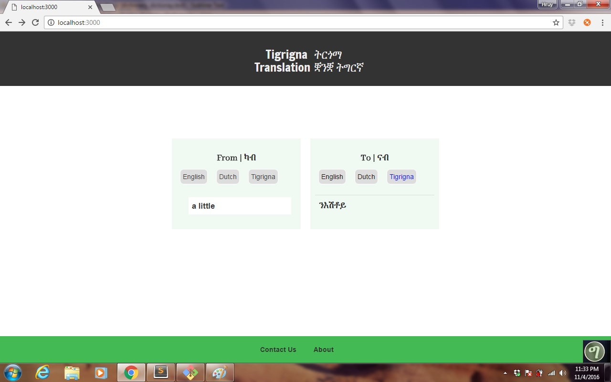
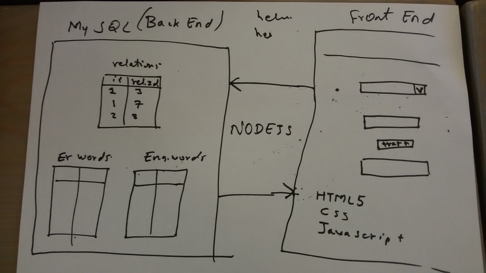
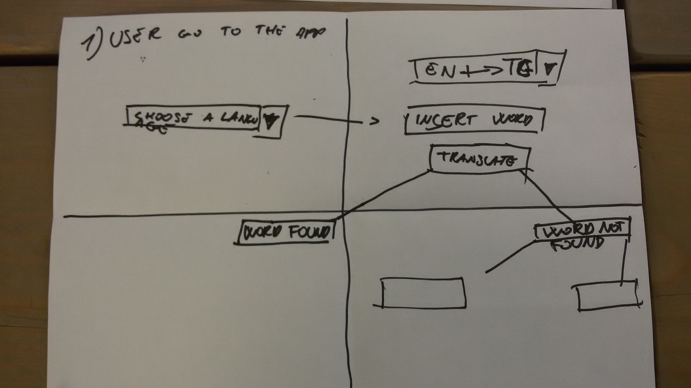
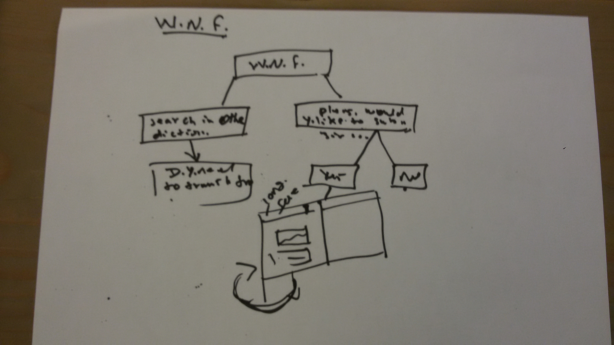
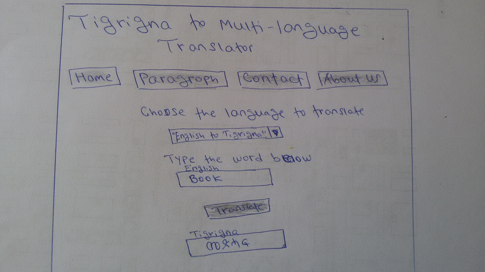

#Project Proposal 

##Project Overview

Almost all the languages in the world are embedded in Google language translation. Eventhough most people in the world can translate their mother-language to different other languages, Eritreans cannot. That’s why we are really passionate to tackle this problem for Eritreans who need to translate any language to Tigrigna and vice-versa.

##Aim of the project
To translate Tigrigna (Eritrean language) to different languages particularly to Englis and Dutch.

##Development approaches of the project already done  
There are list of words for the language English and Dutch, and there is private websites which serve as a standalone Tigrigna dictionary but this private  website has many shortcomings. So our project will eliminate all these shortcomings and will try to satisfy tigrigna language speakers.

##Why the project is needed to be done
Since there are many shortcomings and limitations of the previous web site of Tigrigna translation, we are excited to do a new Tigrigna dictionary with all necessary requirements.  
Finally the aim of our project is that any person, who needs to translate to Tigrigna and from Tigrigna to other languages, will confidently do his work.
We have special reasons to do this project. One of these is the problem encountered on the previous website.  
Some shortcomings of the previous Tigrigna website are:
*  It  hasn’t all Tigrigna words.
*  It is a standalone websites so you cannot switch to different languages except English. 

##Implementation of the project

###Requirements
#Data
We have collection of words in Tigrigna and English in PDF file.
And we converted this pdf data to json file and so we have these words in json file.

### Wireframe

**Home Page**

**Architecture**

**User Flow**

**User Flow**

###Framework
The project will be a client-server application. It will has both backend and front end development.  
**Backend:**
Mysql and Node.js
**Front end:**
HTML, CSS and AngularJS   
**Design**

# Dictionary Project

## To Do

### Autocomplete

- detect typed letters
- timeout after input letters 
- first three letters
- send the request from the browser to the nodejs 
- query to the database
  - input from the user compares with the word in the database
  - matching the first letters begining of the word
  - filter the result to the amount of words needed
- response the output to the user
- display the resul on the browser

**Gide Segid and Hruy Weldemichael**
